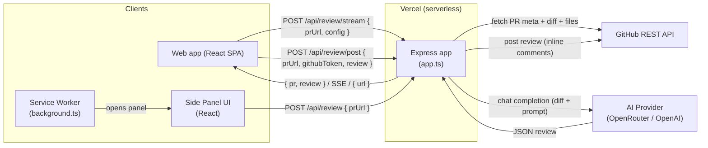
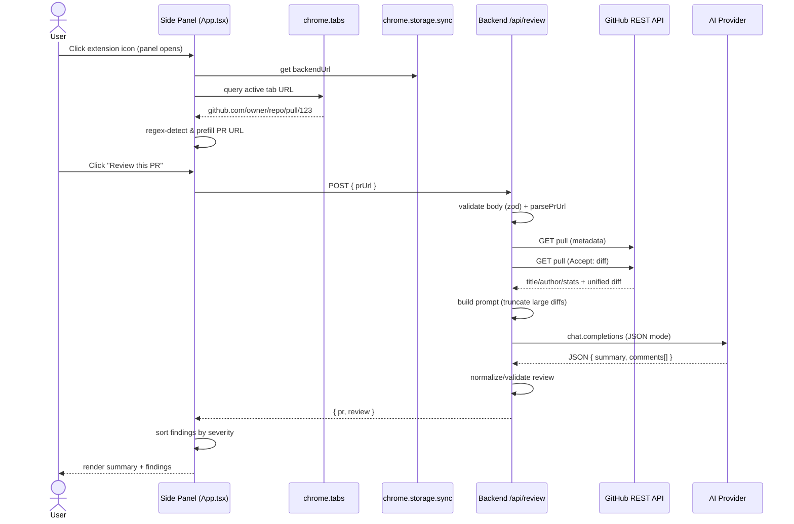
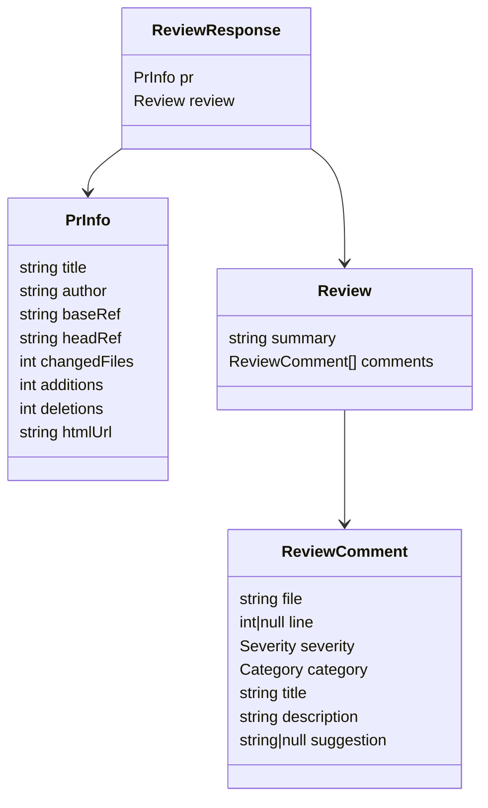
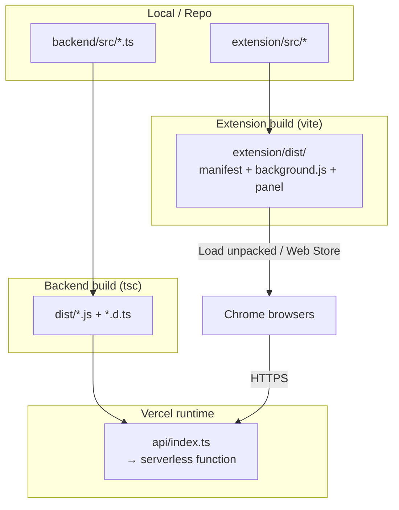
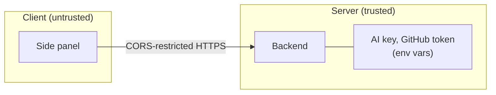

# Architecture — AI Code Review

This document describes the architecture and request flow of the AI Code
Review system: a backend proxy that generates AI-powered reviews of GitHub
pull requests, plus two clients that consume it — a **web app** and a **Chrome
extension** (MV3 side panel).

---

## 1. High-level overview

The system has three independently deployable parts:

- **Web app** (client) — a React + Vite SPA. Paste a GitHub PR link to stream
  the review in the browser, and optionally post it back to the PR as inline
  comments using a GitHub token you supply.
- **Extension** (client) — a Manifest V3 Chrome extension. Its side panel UI
  detects the GitHub PR in the active tab and asks the backend for a review.
  It is read-only: it never writes to GitHub and never holds the AI key.
- **Backend** (server) — a stateless Node/Express app running as a Vercel
  serverless function. It fetches the PR diff from the GitHub REST API, builds
  prompts, calls the AI model (OpenAI-compatible), returns a structured review
  (one-shot or streamed via SSE), and can post a review back to a PR with a
  caller-supplied token.

Key design choices:

- **Backend proxy** keeps the AI API key server-side, never shipped in a client.
- **GitHub REST API** (not DOM scraping) provides a clean, reliable diff.
- **Stateless** backend — no database, no sessions. Each request is independent.
- **User-supplied GitHub token** for write-back — sent per-request, used once,
  never stored or logged.

---

## 2. Component breakdown

### 2.1 Extension (`extension/`)

| File | Role |
| --- | --- |
| [public/manifest.json](file:///Users/bytedance/Documents/Projects/code-review/extension/public/manifest.json) | MV3 manifest. Declares permissions (`sidePanel`, `tabs`, `storage`), host permission for `github.com`, the service worker, and the side panel entry. |
| [src/background/background.ts](file:///Users/bytedance/Documents/Projects/code-review/extension/src/background/background.ts) | Service worker. Configures the toolbar icon to open the side panel on click. |
| [src/sidepanel/App.tsx](file:///Users/bytedance/Documents/Projects/code-review/extension/src/sidepanel/App.tsx) | Main React component. Detects PR URL from the active tab, manages state, calls the backend, persists the backend URL via `chrome.storage.sync`. |
| [src/sidepanel/ReviewResult.tsx](file:///Users/bytedance/Documents/Projects/code-review/extension/src/sidepanel/ReviewResult.tsx) | Renders PR metadata, the AI summary, and findings sorted by severity. |
| [src/sidepanel/types.ts](file:///Users/bytedance/Documents/Projects/code-review/extension/src/sidepanel/types.ts) | Shared TypeScript types mirroring the backend response shape. |
| [src/sidepanel/main.tsx](file:///Users/bytedance/Documents/Projects/code-review/extension/src/sidepanel/main.tsx) / [index.html](file:///Users/bytedance/Documents/Projects/code-review/extension/src/sidepanel/index.html) / [styles.css](file:///Users/bytedance/Documents/Projects/code-review/extension/src/sidepanel/styles.css) | React bootstrap, HTML host, styling. |
| [vite.config.ts](file:///Users/bytedance/Documents/Projects/code-review/extension/vite.config.ts) | Builds two entry points: the side panel (HTML+JS) and the background worker, output to `dist/`. |

### 2.2 Backend (`backend/`)

| File | Role |
| --- | --- |
| [src/app.ts](file:///Users/bytedance/Documents/Projects/code-review/backend/src/app.ts) | `createApp()` — the Express app factory. Defines CORS, `/health`, and `POST /api/review`. Shared by both runtimes. |
| [src/index.ts](file:///Users/bytedance/Documents/Projects/code-review/backend/src/index.ts) | Local dev server (`app.listen`). |
| [api/index.ts](file:///Users/bytedance/Documents/Projects/code-review/backend/api/index.ts) | Vercel serverless entry. Exports the compiled app from `dist/`. |
| [src/github.ts](file:///Users/bytedance/Documents/Projects/code-review/backend/src/github.ts) | `parsePrUrl()` + `fetchPrData()` — parses the PR URL and fetches metadata + unified diff from GitHub. |
| [src/review.ts](file:///Users/bytedance/Documents/Projects/code-review/backend/src/review.ts) | `generateReview()` — builds the prompt, calls the AI model, validates/normalizes the JSON response. |
| [vercel.json](file:///Users/bytedance/Documents/Projects/code-review/backend/vercel.json) | Build/install commands + rewrite routing all paths to the serverless function. |

---

## 3. Request flow (end to end)

### Step-by-step

1. **Panel opens.** The service worker opens the side panel when the toolbar
   icon is clicked.
2. **PR detection.** `App.tsx` loads the saved backend URL from
   `chrome.storage.sync` and queries the active tab. If the URL matches the PR
   pattern (`https://github.com/<owner>/<repo>/pull/<n>`), it prefills it. A
   `/changes` suffix is tolerated (prefix match).
3. **Review request.** On click, the panel POSTs `{ prUrl }` to
   `/api/review` on the configured backend.
4. **Validation.** The backend validates the body with `zod` and parses the PR
   URL. Invalid input → `400`.
5. **GitHub fetch.** Two parallel requests fetch PR metadata (JSON) and the
   unified diff (`Accept: application/vnd.github.v3.diff`). An optional
   `GITHUB_TOKEN` raises the rate limit (60 → 5000 req/hr).
6. **Prompt build.** `review.ts` assembles a system prompt (prioritizing
   correctness → security → quality → performance) plus the PR context and
   diff. Diffs are truncated to a character budget to control token cost.
7. **AI call.** The OpenAI SDK calls the model in JSON mode. `OPENAI_BASE_URL`
   redirects to any OpenAI-compatible gateway (OpenRouter here).
8. **Normalize.** The JSON is parsed and each comment is sanitized
   (severity/category whitelists, type checks).
9. **Response.** `{ pr, review }` is returned. The panel sorts findings by
   severity and renders cards with file/line, badges, and suggestions.

---

## 4. Data shapes

- `Severity`: `critical | high | medium | low | info`
- `Category`: `correctness | security | quality | performance`

---

## 5. Deployment & build pipeline

- **Backend:** Vercel runs `pnpm build` (tsc → `dist/`), then bundles
  `api/index.ts`, which imports the compiled app. Env vars
  (`OPENAI_API_KEY`, `OPENAI_BASE_URL`, `OPENAI_MODEL`, `ALLOWED_ORIGINS`) are
  set in the Vercel project, not committed.
- **Extension:** `vite build` outputs `extension/dist/`, loaded unpacked in
  Chrome (or published to the Web Store). The default backend URL points at the
  Vercel deployment; it can be overridden in **Settings → Backend URL**.

---

## 6. Security & trust boundaries

- **Secrets stay server-side.** The AI key and optional GitHub token live only
  in Vercel env vars; the extension never sees them.
- **CORS.** `ALLOWED_ORIGINS` restricts who can call the backend. During
  development it is `*`; in production it should be set to
  `chrome-extension://<extension-id>` so others cannot use (and bill) your
  backend.
- **Scope.** Public repositories / public PRs only — no GitHub OAuth flow yet.
- **Read-only.** No write scopes; reviews are never posted back to GitHub.

---

## 7. Current limitations

- Reviewing supports public repos only (no private-repo auth flow).
- Write-back requires a user-supplied GitHub token with write access.
- Large PRs are chunked by file (map-reduce); merging summaries is by
  concatenation rather than a second LLM pass.
- No persistence — reviews are not stored or shareable via a link.
- Single-page file fetch for write-back (first 100 changed files).
